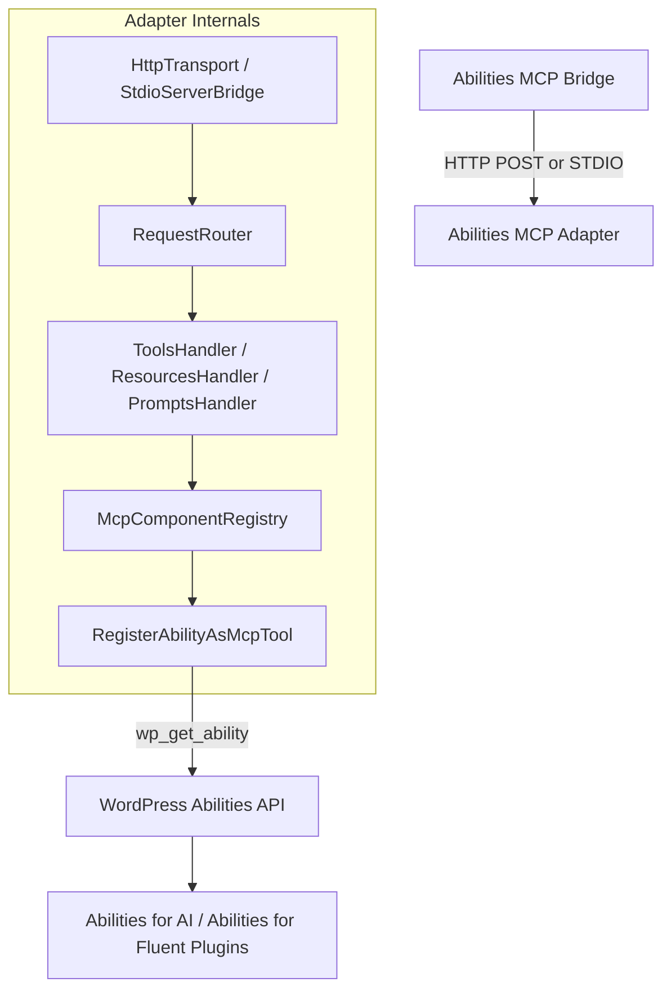
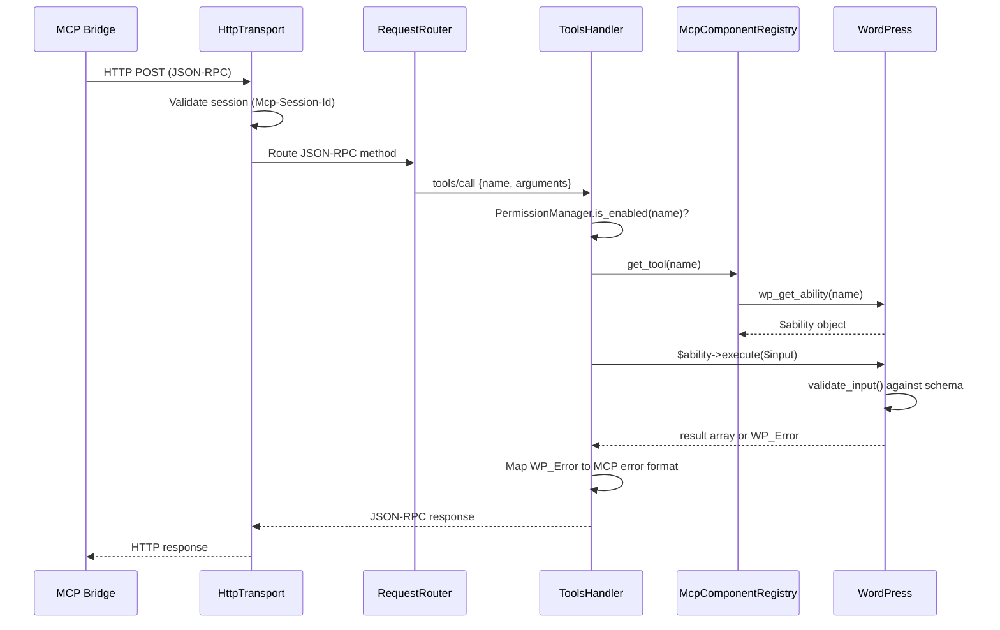
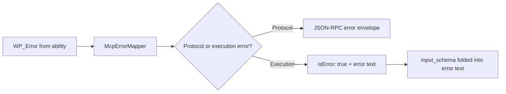

# Adapter Architecture

How Abilities MCP Adapter translates WordPress abilities into MCP protocol — transport, handlers, component mapping, and the security model.

## Where It Sits in the Stack



The Adapter sits between the MCP Bridge and WordPress. It receives JSON-RPC messages, routes them to the correct handler, and translates WordPress abilities into MCP-compliant tool definitions.

## Directory Structure

```
abilities-mcp-adapter/
├── abilities-mcp-adapter.php    # Bootstrap — constants, autoloader, updater
├── src/
│   ├── Abilities/               # Built-in meta-abilities
│   │   ├── DiscoverAbilitiesAbility.php
│   │   ├── ExecuteAbilityAbility.php
│   │   ├── GetAbilityInfoAbility.php
│   │   ├── GetStartedAbility.php
│   │   ├── BatchExecuteAbility.php
│   │   └── McpAbilityHelperTrait.php
│   ├── Admin/
│   │   ├── AbilitySettingsPage.php    # Settings > MCP Abilities UI
│   │   └── PermissionManager.php      # Per-ability enable/disable
│   ├── Core/
│   │   ├── McpAdapter.php             # Plugin lifecycle + server management
│   │   ├── McpServer.php              # MCP server instance
│   │   ├── McpServerConfig.php        # Immutable config object
│   │   ├── McpComponentRegistry.php   # Tool/resource/prompt registry
│   │   └── McpTransportFactory.php    # Transport instantiation
│   ├── Domain/
│   │   ├── Tools/                     # Ability-to-Tool conversion
│   │   ├── Resources/                 # Ability-to-Resource conversion
│   │   ├── Prompts/                   # Ability-to-Prompt conversion
│   │   └── Utils/                     # Schema transformer, validators
│   ├── Handlers/
│   │   ├── Tools/ToolsHandler.php     # tools/list, tools/call
│   │   ├── Resources/                 # resources/list, resources/read
│   │   ├── Prompts/                   # prompts/list, prompts/get
│   │   ├── Initialize/                # MCP handshake + version negotiation
│   │   └── System/                    # System-level handlers
│   ├── Infrastructure/
│   │   ├── ErrorHandling/             # WP_Error to MCP error mapping
│   │   └── Observability/             # Logging and metrics
│   ├── Transport/
│   │   ├── HttpTransport.php          # REST API endpoint
│   │   └── Infrastructure/            # Session management, request routing
│   ├── Servers/
│   │   └── DefaultServerFactory.php   # Default server configuration
│   └── Plugin.php                     # Hook registration
├── includes/
│   ├── class-license-manager.php      # FluentCart license
│   └── updater/                       # FluentCart + GitHub auto-update
└── vendor/                            # Composer autoloader
```

## Request Flow



## Protocol Version Negotiation

The Adapter supports MCP spec versions `2025-06-18` and `2025-11-25`. During the `initialize` handshake, it reflects the client's requested version back if supported, or falls back to the latest supported version.

This eliminates the need for the Bridge to rewrite protocol versions in transit.

## Built-in Meta-Abilities

Five abilities that the Adapter registers itself (not from ability plugins):

| Ability | Purpose |
|---------|---------|
| `mcp-adapter/get-started` | AI onboarding entry point. Directs to Knowledge Layer if available. |
| `mcp-adapter/discover-abilities` | List all available abilities. Supports `category`, `search`, `compact`, `limit`/`offset`. |
| `mcp-adapter/get-ability-info` | Get full schema and metadata for a specific ability. |
| `mcp-adapter/execute-ability` | Execute any ability by name with parameters. |
| `mcp-adapter/batch-execute` | Execute up to 20 abilities in a single round-trip. |

## Security Model

Two permission layers, both must pass:

| Layer | What | How |
|-------|------|-----|
| **WordPress Capability** | Does the MCP user have the required role? | `permission_callback` on each ability checks `current_user_can()` |
| **Adapter Permission Toggle** | Is this specific ability enabled in settings? | `PermissionManager::is_enabled()` checked at execution time in `ToolsHandler` |

The admin dashboard (Settings > MCP Abilities) provides per-ability toggles. Disabled abilities return a structured error with the required permission level — the AI agent sees exactly what it needs enabled.

## Error Handling



Execution errors include the ability's `input_schema` in the error response — the AI agent sees what parameters were expected alongside what went wrong, enabling self-correction without a separate discovery call.

## Component Conversion

The Domain layer converts WordPress abilities into MCP components:

| WordPress | MCP | Converter |
|-----------|-----|-----------|
| Ability with `mcp.type = 'tool'` (default) | MCP Tool | `RegisterAbilityAsMcpTool` |
| Ability with `mcp.type = 'resource'` | MCP Resource | `RegisterAbilityAsMcpResource` |
| Ability with `mcp.type = 'prompt'` | MCP Prompt | `RegisterAbilityAsMcpPrompt` |

`SchemaTransformer` converts WordPress `input_schema` (JSON Schema draft-04) into MCP-compatible tool input definitions. Annotations (`readonly`, `destructive`, `idempotent`) map to MCP hint fields.

## Related

- [README](../README.md) — installation and usage
- [CHANGELOG](../CHANGELOG.md) — version history
